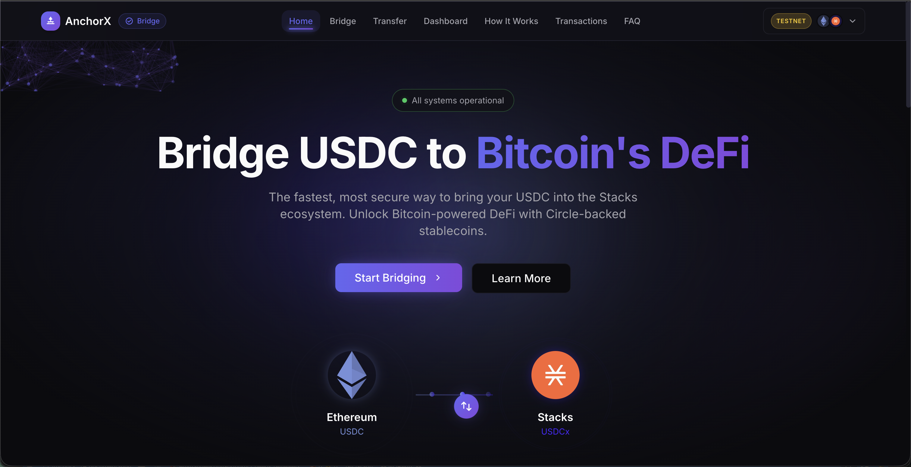
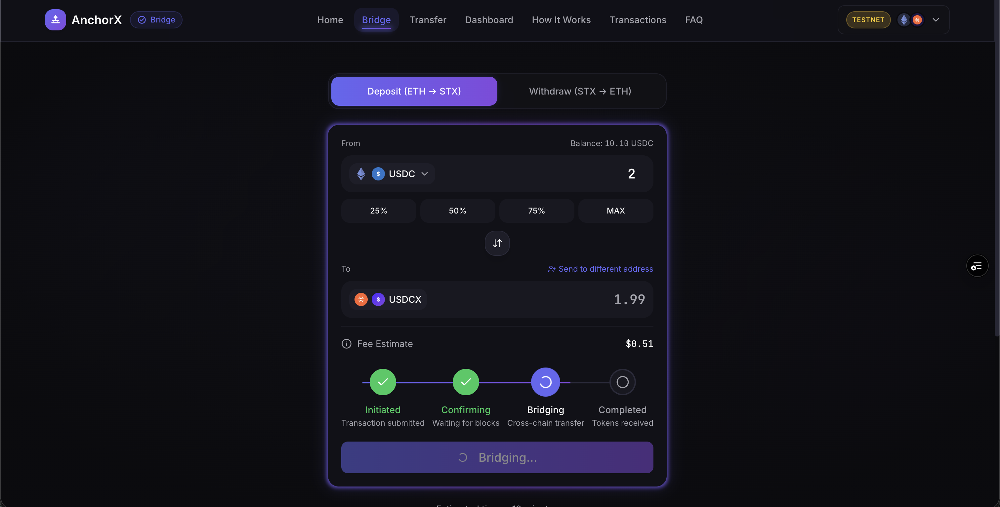
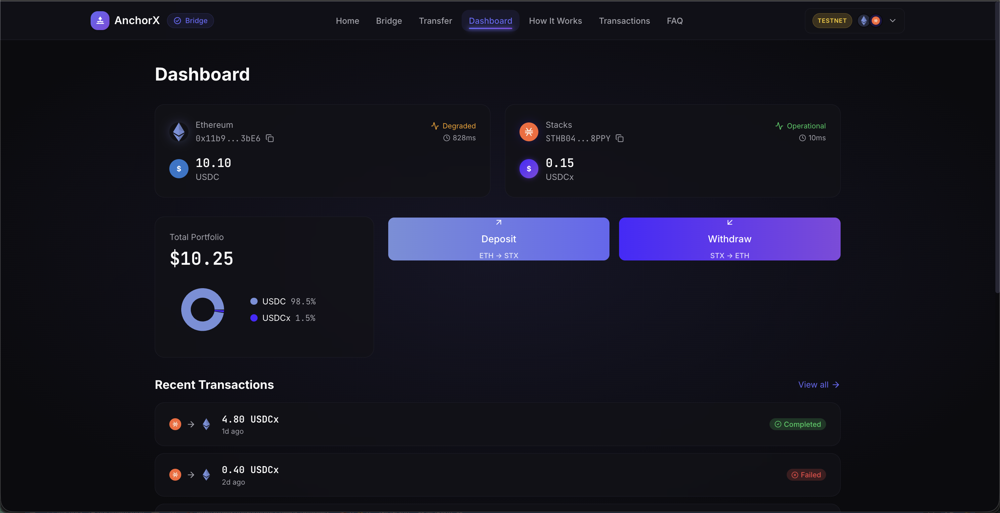
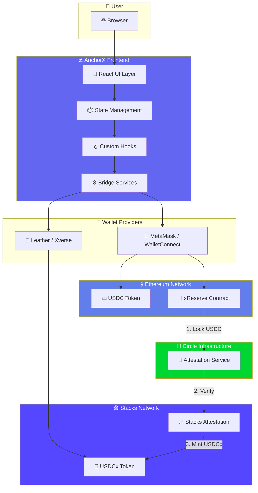
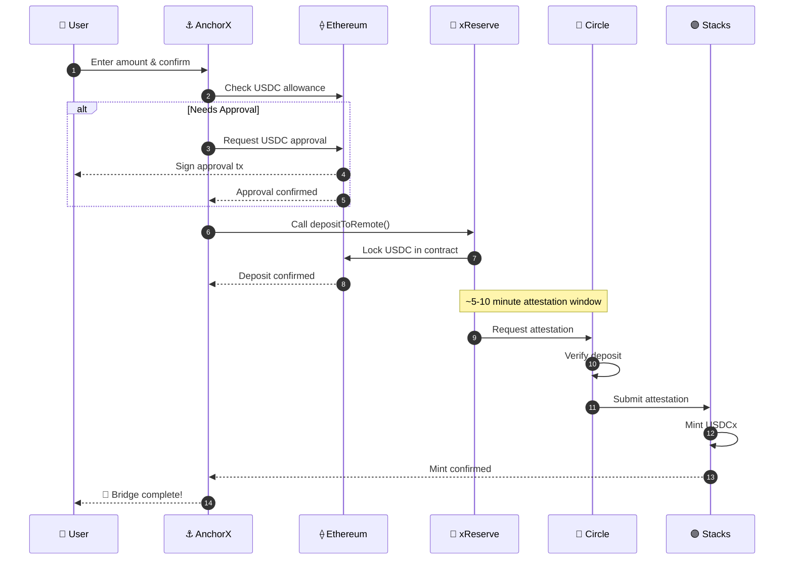
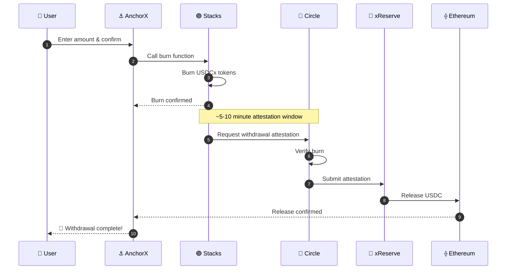
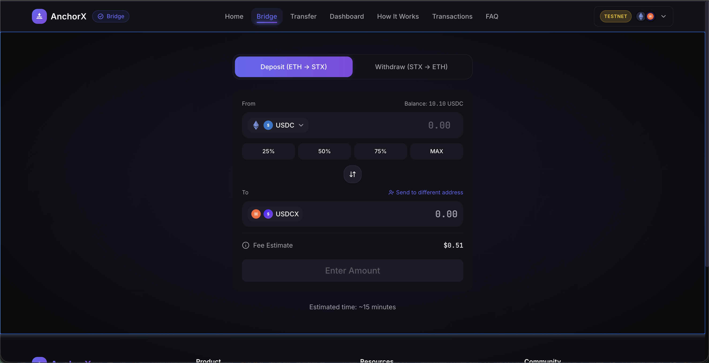
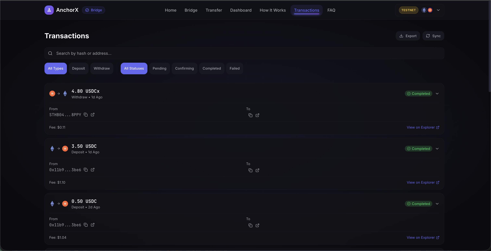
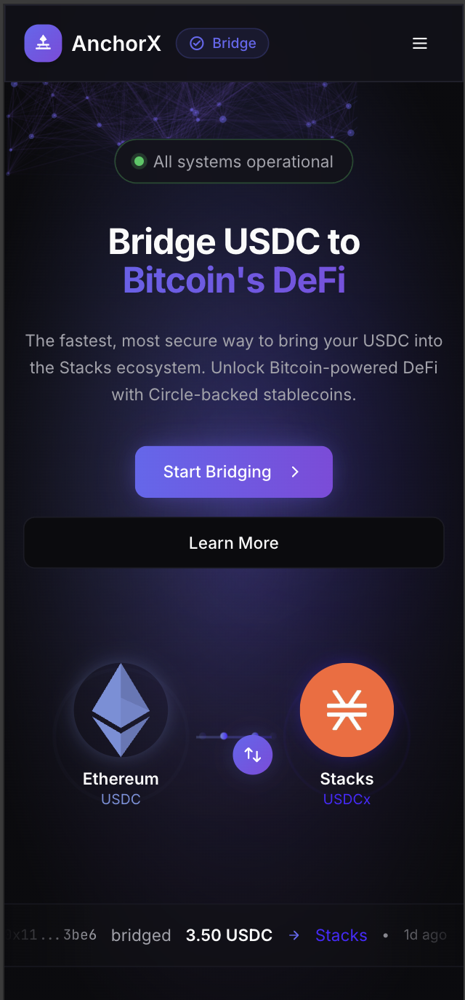

<div align="center">

<!-- Animated Header -->


<br/>

<!-- Typing Animation -->
<a href="https://git.io/typing-svg"></a>

<br/>
<br/>

<!-- Main Badges -->
<p>
  <a href="https://ethereum.org">
    
  </a>
  <a href="https://www.stacks.co">
    
  </a>
  <a href="https://www.circle.com">
    
  </a>
  <a href="https://bitcoin.org">
    
  </a>
</p>

<!-- Status Badges -->
<p>
  
  
  
  
</p>

<!-- Tech Stack Badges -->
<p>
  
  
  
  
  
  
</p>

<!-- Links -->
<p>
  <a href="#-quick-start"><strong>Quick Start</strong></a> ·
  <a href="#-features"><strong>Features</strong></a> ·
  <a href="#️-architecture"><strong>Architecture</strong></a> ·
  <a href="#-demo"><strong>Demo</strong></a> ·
  <a href="#-documentation"><strong>Docs</strong></a>
</p>

<br/>

<!-- Hero Image - Landing Page -->


<br/>
<br/>

</div>

---

<div align="center">

## 💫 Why AnchorX?

</div>

<table>
<tr>
<td width="50%">

### 🎯 The Problem

Bridging assets between Ethereum and Stacks has traditionally been:

- ❌ **Complex** — Multiple steps, confusing interfaces
- ❌ **Slow** — Long wait times with no visibility
- ❌ **Risky** — Unclear transaction status
- ❌ **Expensive** — Hidden fees and poor gas optimization

</td>
<td width="50%">

### ✅ The AnchorX Solution

We've built the bridge experience users deserve:

- ✨ **One-Click** — Approval + bridge in single flow
- ⚡ **15 Minutes** — Average bridge completion time  
- 🛡️ **Secure** — Circle's xReserve + real-time tracking
- 💰 **Transparent** — Clear fees, gas optimization

</td>
</tr>
</table>

---

<div align="center">

## 🏆 Key Metrics

<br/>

<table>
<tr>
<td align="center" width="25%">

<br/><sub><b>Transaction Success</b></sub>
</td>
<td align="center" width="25%">

<br/><sub><b>Average Completion</b></sub>
</td>
<td align="center" width="25%">

<br/><sub><b>Low Fee Structure</b></sub>
</td>
<td align="center" width="25%">

<br/><sub><b>Always Online</b></sub>
</td>
</tr>
</table>

</div>

---

## 📋 Table of Contents

<details>
<summary>Click to expand</summary>

- [💫 Why AnchorX?](#-why-anchorx)
- [🏆 Key Metrics](#-key-metrics)
- [✨ Features](#-features)
- [🎬 Demo](#-demo)
- [🚀 Quick Start](#-quick-start)
- [🏗️ Architecture](#️-architecture)
- [🌉 How Bridging Works](#-how-bridging-works)
- [📱 Screenshots](#-screenshots)
- [🔐 Security](#-security)
- [📄 Smart Contracts](#-smart-contracts)
- [🛠️ Technology Stack](#️-technology-stack)
- [📁 Project Structure](#-project-structure)
- [👛 Wallet Support](#-wallet-support)
- [⌨️ Keyboard Shortcuts](#️-keyboard-shortcuts)
- [🧪 Testing](#-testing)
- [🚢 Deployment](#-deployment)
- [🗺️ Roadmap](#️-roadmap)
- [🤝 Contributing](#-contributing)
- [❓ FAQ](#-faq)
- [📜 License](#-license)

</details>

---

## ✨ Features

<div align="center">

### 🌟 Core Capabilities

</div>

<table>
<tr>
<td width="33%" align="center">

### ⚡ Lightning Bridge


**One-Click Bridging**

Streamlined UX that handles USDC approval and bridge deposit in a single, seamless flow. No more confusing multi-step processes.

</td>
<td width="33%" align="center">

### 📊 Real-Time Tracking


**Live Status Updates**

Watch your transaction progress through every step — from initiation to confirmation — with block-by-block updates.

</td>
<td width="33%" align="center">

### 🔄 Bi-Directional


**Deposit & Withdraw**

Move seamlessly between Ethereum USDC and Stacks USDCx in either direction with the same intuitive interface.

</td>
</tr>
<tr>
<td width="33%" align="center">

### 💰 Dual Dashboard


**Unified Portfolio View**

See your complete cross-chain balance at a glance. Track USDC, USDCx, ETH, and STX all in one beautiful dashboard.

</td>
<td width="33%" align="center">

### 🎨 Stunning UI/UX


**Premium Design**

Dark mode interface with smooth animations, particle effects, and micro-interactions that make bridging a delight.

</td>
<td width="33%" align="center">

### 📱 Mobile First


**Fully Responsive**

Optimized for every screen size with touch-friendly controls and mobile wallet deep linking.

</td>
</tr>
</table>

<br/>

<details>
<summary><strong>🔥 See All Features</strong></summary>

<br/>

### Bridge Features
| Feature | Description |
|---------|-------------|
| 🔄 **Bi-Directional Bridge** | Deposit USDC → USDCx and Withdraw USDCx → USDC |
| ⚡ **One-Click Flow** | Approval + bridge combined into single transaction |
| 📍 **Custom Recipients** | Bridge directly to any valid Stacks/Ethereum address |
| 💵 **Fee Calculator** | Real-time fee estimation with gas price tracking |
| 📊 **Progress Timeline** | Visual step-by-step bridge progress indicator |
| 🔔 **Notifications** | Toast alerts for every transaction state change |

### Dashboard Features
| Feature | Description |
|---------|-------------|
| 💰 **Dual Balance View** | USDC + USDCx displayed simultaneously |
| 📈 **Portfolio Charts** | Historical balance visualization with Recharts |
| 🔄 **Live Sync** | Real-time balance updates across both chains |
| 📋 **Transaction History** | Complete bridge history with status tracking |
| 🔗 **Explorer Links** | One-click access to Etherscan & Hiro Explorer |

### UX Features
| Feature | Description |
|---------|-------------|
| 🎓 **Guided Onboarding** | Interactive tour for first-time users |
| 💾 **Preference Persistence** | Remembers your last bridge direction & amount |
| ⌨️ **Keyboard Shortcuts** | Power user shortcuts for common actions |
| ♿ **Accessibility** | WCAG 2.1 AA compliant with screen reader support |
| 🎨 **Reduced Motion** | Respects user motion preferences |
| 🌙 **Dark Mode** | Beautiful dark theme (light mode coming soon) |

### Technical Features
| Feature | Description |
|---------|-------------|
| 🛡️ **Error Boundaries** | Graceful error handling and recovery |
| 📍 **Address Validation** | Real-time validation for all addresses |
| 🔄 **Auto-Refresh** | Balances and statuses update automatically |
| 📱 **PWA Ready** | Installable as a Progressive Web App |
| 🚀 **Optimized Build** | Code splitting and lazy loading for fast loads |

</details>

---

## 🎬 Demo

<div align="center">

### Watch AnchorX in Action

<br/>

<!-- Video Placeholder -->
<a href="https://youtu.be/demo-link">
  
</a>

<br/>
<br/>

<!-- GIF Demo Placeholder -->
<table>
<tr>
<td align="center" width="50%">

**🔄 Bridge Flow**



*Complete deposit in one click*

</td>
<td align="center" width="50%">

**📊 Dashboard**



*Track your cross-chain portfolio*

</td>
</tr>
</table>

</div>

---

## 🚀 Quick Start

<div align="center">

### Get up and running in under 2 minutes

</div>

<br/>

### Prerequisites

<table>
<tr>
<td>

```
✅ Node.js 18+
✅ Bun or npm
✅ Git
```

</td>
<td>

```
✅ MetaMask or WalletConnect wallet
✅ Leather or Xverse (Stacks wallet)
✅ Testnet tokens (see faucets below)
```

</td>
</tr>
</table>

### Installation

```bash
# 1️⃣ Clone the repository
git clone https://github.com/emmanuelist/anchor-x.git

# 2️⃣ Navigate to frontend
cd anchor-x/frontend

# 3️⃣ Install dependencies
bun install  # or npm install

# 4️⃣ Start development server
bun run dev  # or npm run dev
```

<div align="center">

🎉 **Open [http://localhost:8080](http://localhost:8080) and start bridging!**

</div>

<br/>

### Environment Setup

Create a `.env` file:

```env
# Required
VITE_WALLETCONNECT_PROJECT_ID=your_walletconnect_project_id

# Optional (uses defaults if not provided)
VITE_ETHEREUM_RPC_URL=https://sepolia.infura.io/v3/YOUR_KEY
VITE_STACKS_API_URL=https://api.testnet.hiro.so
```

<br/>

### 🚰 Get Testnet Tokens

<table>
<tr>
<td align="center" width="33%">


**Sepolia ETH**

[Alchemy Faucet](https://sepoliafaucet.com/)

</td>
<td align="center" width="33%">


**Sepolia USDC**

[Circle Faucet](https://faucet.circle.com/)

</td>
<td align="center" width="33%">


**Testnet STX**

[Hiro Faucet](https://explorer.hiro.so/sandbox/faucet?chain=testnet)

</td>
</tr>
</table>

---

## 🏗️ Architecture

<div align="center">

### System Overview

</div>



<br/>

<div align="center">

### Component Architecture

</div>

```
┌─────────────────────────────────────────────────────────────────────────┐
│                              App.tsx                                     │
│  ┌───────────────────────────────────────────────────────────────────┐  │
│  │  🛡️ ErrorBoundary                                                  │  │
│  │  ┌─────────────────────────────────────────────────────────────┐  │  │
│  │  │  🔗 AppKitProvider (Web3 Modal)                              │  │  │
│  │  │  ┌───────────────────────────────────────────────────────┐  │  │  │
│  │  │  │  📊 QueryClientProvider (TanStack Query)              │  │  │  │
│  │  │  │  ┌─────────────────────────────────────────────────┐  │  │  │  │
│  │  │  │  │  👛 WalletProvider (Custom Context)             │  │  │  │  │
│  │  │  │  │  ┌───────────────────────────────────────────┐  │  │  │  │  │
│  │  │  │  │  │  💬 TooltipProvider + Toasters            │  │  │  │  │  │
│  │  │  │  │  │  ┌─────────────────────────────────────┐  │  │  │  │  │  │
│  │  │  │  │  │  │  🧭 BrowserRouter                   │  │  │  │  │  │  │
│  │  │  │  │  │  │  ┌───────────────────────────────┐  │  │  │  │  │  │  │
│  │  │  │  │  │  │  │  🎓 OnboardingProvider        │  │  │  │  │  │  │  │
│  │  │  │  │  │  │  │  ┌─────────────────────────┐  │  │  │  │  │  │  │  │
│  │  │  │  │  │  │  │  │      📄 Routes          │  │  │  │  │  │  │  │  │
│  │  │  │  │  │  │  │  │  ├── 🏠 Index           │  │  │  │  │  │  │  │  │
│  │  │  │  │  │  │  │  │  ├── 🌉 Bridge          │  │  │  │  │  │  │  │  │
│  │  │  │  │  │  │  │  │  ├── 📊 Dashboard       │  │  │  │  │  │  │  │  │
│  │  │  │  │  │  │  │  │  ├── 📜 Transactions    │  │  │  │  │  │  │  │  │
│  │  │  │  │  │  │  │  │  ├── 💸 Transfer        │  │  │  │  │  │  │  │  │
│  │  │  │  │  │  │  │  │  ├── 📖 HowItWorks      │  │  │  │  │  │  │  │  │
│  │  │  │  │  │  │  │  │  └── ❓ FAQ             │  │  │  │  │  │  │  │  │
└──┴──┴──┴──┴──┴──┴──┴──┴───────────────────────────────┴──┴──┴──┴──┴──┴──┘
```

---

## 🌉 How Bridging Works

<div align="center">

### Deposit Flow: USDC → USDCx

*Ethereum to Stacks*

</div>



<br/>

<div align="center">

### Withdraw Flow: USDCx → USDC

*Stacks to Ethereum*

</div>



<br/>

<div align="center">

### Bridge Progress Timeline

</div>

```
                            DEPOSIT PROGRESS
    ═══════════════════════════════════════════════════════════════
    
    ● INITIATED                    Transaction submitted
    │   └─ Tx Hash: 0x1234...abcd
    │
    ● CONFIRMING                   Waiting for confirmations
    │   └─ ████████████░░░░░░░░    12/20 blocks
    │
    ◐ ATTESTING                    Circle verification in progress
    │   └─ Estimated: ~5 minutes remaining
    │
    ○ MINTING                      Awaiting USDCx mint on Stacks
    │
    ○ COMPLETE                     Bridge successful! ✨
    
    ═══════════════════════════════════════════════════════════════
```

---

## 📱 Screenshots

<div align="center">

### Landing Page

*Premium hero with live transaction ticker and network status*


<br/>
<br/>

### Bridge Interface

*One-click bridging with transparent fees and real-time progress*



<br/>
<br/>

<table>
<tr>
<td width="50%">

### Dashboard

*Dual-chain portfolio view*


</td>
<td width="50%">

### Transaction History

*Complete bridge history*



</td>
</tr>
<tr>
<td width="50%">

### Mobile View

*Fully responsive design*



</td>
<td width="50%">

### Wallet Connection

*Multi-wallet support*


</td>
</tr>
</table>

</div>

---

## 🔐 Security

<div align="center">

### Your Assets Are Protected

</div>

<table>
<tr>
<td width="25%" align="center">

### 🔵 Circle xReserve

Industry-leading attestation protocol by Circle, the issuer of USDC

</td>
<td width="25%" align="center">

### 🔒 Non-Custodial

Your keys, your crypto. We never have access to your private keys

</td>
<td width="25%" align="center">

### ✅ Audited Contracts

Smart contracts audited by leading security firms

</td>
<td width="25%" align="center">

### 🛡️ Open Source

Fully transparent codebase — verify everything yourself

</td>
</tr>
</table>

<br/>

### Security Best Practices

```
✅ All wallet connections use WalletConnect v2 / direct provider injection
✅ Transaction simulation before execution
✅ Address validation with checksum verification  
✅ Rate limiting and request throttling
✅ No sensitive data stored in local storage
✅ HTTPS only — all API calls are encrypted
✅ Content Security Policy headers
```

---

## 📄 Smart Contracts

<div align="center">

### Testnet Contracts (Sepolia / Stacks Testnet)

</div>

| Contract | Network | Address | Explorer |
|:--------:|:-------:|:--------|:--------:|
| 🔐 **xReserve** | Ethereum Sepolia | `0x008888878f94C0d87defdf0B07f46B93C1934442` | [↗](https://sepolia.etherscan.io/address/0x008888878f94C0d87defdf0B07f46B93C1934442) |
| 💵 **USDC** | Ethereum Sepolia | `0x1c7D4B196Cb0C7B01d743Fbc6116a902379C7238` | [↗](https://sepolia.etherscan.io/address/0x1c7D4B196Cb0C7B01d743Fbc6116a902379C7238) |
| 💎 **USDCx** | Stacks Testnet | `ST1F7QA2MDF17S807EPA36TSS8AMEFY4KA9TVGWXT.usdcx` | [↗](https://explorer.hiro.so/txid/ST1F7QA2MDF17S807EPA36TSS8AMEFY4KA9TVGWXT.usdcx?chain=testnet) |
| 🔄 **USDCx-v1** | Stacks Testnet | `ST1F7QA2MDF17S807EPA36TSS8AMEFY4KA9TVGWXT.usdcx-v1` | [↗](https://explorer.hiro.so/txid/ST1F7QA2MDF17S807EPA36TSS8AMEFY4KA9TVGWXT.usdcx-v1?chain=testnet) |

<br/>

<div align="center">

### Mainnet Contracts

</div>

| Contract | Network | Address | Explorer |
|:--------:|:-------:|:--------|:--------:|
| 💵 **USDC** | Ethereum | `0xA0b86991c6218b36c1d19D4a2e9Eb0cE3606eB48` | [↗](https://etherscan.io/address/0xA0b86991c6218b36c1d19D4a2e9Eb0cE3606eB48) |
| 💎 **USDCx** | Stacks | `SP3Y2ZSH8P7D50B0VBTSX11S7XSG24M1VB9YFQA4K.usdcx` | [↗](https://explorer.hiro.so/txid/SP3Y2ZSH8P7D50B0VBTSX11S7XSG24M1VB9YFQA4K.usdcx?chain=mainnet) |

<br/>

### Protocol Constants

```typescript
const ANCHORX_PROTOCOL = {
  // Circle xReserve Configuration
  STACKS_DOMAIN_ID: 10003,          // Circle domain identifier for Stacks
  
  // Token Configuration
  USDC_DECIMALS: 6,                 // USDC uses 6 decimal places
  USDCX_DECIMALS: 6,                // USDCx maintains same precision
  
  // Bridge Limits
  MIN_BRIDGE_AMOUNT: "1.00",        // Minimum 1 USDC per transaction
  MAX_BRIDGE_AMOUNT: "1000000.00",  // Maximum 1M USDC per transaction
  
  // Timing Estimates
  DEPOSIT_TIME_MINUTES: 15,         // Average deposit completion
  WITHDRAW_TIME_MINUTES: 20,        // Average withdrawal completion
  
  // Fee Structure  
  BRIDGE_FEE_PERCENT: 0.1,          // 0.1% bridge fee
  MIN_FEE_USD: 0.01,                // Minimum fee floor
} as const;
```

---

## 🛠️ Technology Stack

<div align="center">

### Frontend Technologies

</div>

<table>
<tr>
<td align="center" width="14%">

<br><sub><b>React 18</b></sub>
</td>
<td align="center" width="14%">

<br><sub><b>TypeScript</b></sub>
</td>
<td align="center" width="14%">

<br><sub><b>Vite 5</b></sub>
</td>
<td align="center" width="14%">

<br><sub><b>Tailwind</b></sub>
</td>
<td align="center" width="14%">

<br><sub><b>Framer Motion</b></sub>
</td>
<td align="center" width="14%">

<br><sub><b>TanStack Query</b></sub>
</td>
<td align="center" width="14%">

<br><sub><b>React Hook Form</b></sub>
</td>
</tr>
</table>

<br/>

<div align="center">

### Web3 Technologies

</div>

<table>
<tr>
<td align="center" width="20%">

<br><sub><b>wagmi</b></sub>
<br><sub>Ethereum Hooks</sub>
</td>
<td align="center" width="20%">

<br><sub><b>viem</b></sub>
<br><sub>Ethereum Client</sub>
</td>
<td align="center" width="20%">

<br><sub><b>Reown AppKit</b></sub>
<br><sub>Wallet Modal</sub>
</td>
<td align="center" width="20%">

<br><sub><b>@stacks/connect</b></sub>
<br><sub>Stacks SDK</sub>
</td>
<td align="center" width="20%">

<br><sub><b>Zod</b></sub>
<br><sub>Validation</sub>
</td>
</tr>
</table>

<br/>

<details>
<summary><strong>📦 Full Dependency List</strong></summary>

```json
{
  "dependencies": {
    "@hookform/resolvers": "^3.10.0",
    "@radix-ui/react-*": "^1.x",
    "@reown/appkit": "^1.8.16",
    "@reown/appkit-adapter-wagmi": "^1.8.16",
    "@stacks/connect": "^8.2.4",
    "@stacks/network": "^7.3.1",
    "@stacks/transactions": "^7.3.1",
    "@tanstack/react-query": "^5.83.0",
    "class-variance-authority": "^0.7.1",
    "clsx": "^2.1.1",
    "date-fns": "^3.6.0",
    "framer-motion": "^11.18.2",
    "lucide-react": "^0.462.0",
    "react": "^18.3.1",
    "react-dom": "^18.3.1",
    "react-hook-form": "^7.61.1",
    "react-router-dom": "^6.30.1",
    "recharts": "^2.15.4",
    "sonner": "^1.7.4",
    "tailwind-merge": "^2.6.0",
    "viem": "^2.44.4",
    "wagmi": "^2.19.5",
    "zod": "^3.25.76"
  }
}
```

</details>

---

## 📁 Project Structure

```
frontend/
├── 📂 public/                      # Static assets
│   ├── robots.txt                  # SEO configuration
│   └── site.webmanifest           # PWA manifest
│
├── 📂 src/
│   ├── 📂 assets/                  # Images, fonts, icons
│   │
│   ├── 📂 components/
│   │   ├── 📂 layout/              # App shell components
│   │   │   ├── Header.tsx          # Navigation header
│   │   │   ├── Footer.tsx          # Site footer
│   │   │   └── Layout.tsx          # Page wrapper
│   │   │
│   │   ├── 📂 ui/                  # 70+ reusable components
│   │   │   ├── GlowCard.tsx        # Glowing card effect
│   │   │   ├── BridgeTimeline.tsx  # Progress indicator
│   │   │   ├── ChainIcon.tsx       # Chain logo display
│   │   │   ├── ParticleField.tsx   # Background particles
│   │   │   ├── AnimatedCounter.tsx # Number animations
│   │   │   ├── PreviewModal.tsx    # Bridge preview
│   │   │   ├── SuccessModal.tsx    # Success celebration
│   │   │   └── ...                 # + many more
│   │   │
│   │   ├── ErrorBoundary.tsx       # Error handling
│   │   ├── NavLink.tsx             # Active navigation
│   │   └── OnboardingProvider.tsx  # Guided tour
│   │
│   ├── 📂 contexts/
│   │   └── WalletContext.tsx       # Dual-chain wallet state
│   │
│   ├── 📂 hooks/
│   │   ├── useBridge.ts            # Bridge operations
│   │   ├── useOnboarding.ts        # Tour management
│   │   ├── usePreferences.ts       # User settings
│   │   ├── usePageMeta.ts          # SEO management
│   │   └── useReducedMotion.ts     # Accessibility
│   │
│   ├── 📂 lib/
│   │   ├── 📂 appkit/              # Web3 modal config
│   │   │
│   │   ├── 📂 bridge/              # Bridge service layer
│   │   │   ├── deposit.ts          # USDC → USDCx
│   │   │   ├── withdraw.ts         # USDCx → USDC
│   │   │   ├── encoding.ts         # Address encoding
│   │   │   ├── transactionStatus.ts
│   │   │   └── index.ts            # Exports
│   │   │
│   │   ├── 📂 constants/           # Config & ABIs
│   │   ├── 📂 ethereum/            # ETH wallet service
│   │   ├── 📂 stacks/              # STX wallet service
│   │   ├── 📂 services/            # External APIs
│   │   └── 📂 utils/               # Helper functions
│   │
│   ├── 📂 pages/
│   │   ├── Index.tsx               # 🏠 Landing page
│   │   ├── Bridge.tsx              # 🌉 Bridge interface
│   │   ├── Dashboard.tsx           # 📊 Portfolio view
│   │   ├── Transactions.tsx        # 📜 History
│   │   ├── Transfer.tsx            # 💸 Direct send
│   │   ├── HowItWorks.tsx          # 📖 Education
│   │   ├── FAQ.tsx                 # ❓ Support
│   │   └── NotFound.tsx            # 404 page
│   │
│   ├── App.tsx                     # Root component
│   ├── App.css                     # Global styles
│   ├── index.css                   # Tailwind imports
│   └── main.tsx                    # Entry point
│
├── 📄 index.html                   # HTML template
├── 📄 package.json                 # Dependencies
├── 📄 tailwind.config.ts           # Tailwind config
├── 📄 tsconfig.json                # TypeScript config
├── 📄 vite.config.ts               # Vite config
└── 📄 README.md                    # You are here! 📍
```

---

## 👛 Wallet Support

<div align="center">

### Ethereum Wallets

</div>

<table>
<tr>
<td align="center" width="20%">

<br/><b>MetaMask</b>
<br/>✅ Full Support
</td>
<td align="center" width="20%">

<br/><b>WalletConnect</b>
<br/>✅ 100+ Wallets
</td>
<td align="center" width="20%">

<br/><b>Coinbase</b>
<br/>✅ Full Support
</td>
<td align="center" width="20%">

<br/><b>Rainbow</b>
<br/>✅ Full Support
</td>
<td align="center" width="20%">

<br/><b>Trust Wallet</b>
<br/>✅ Via WC
</td>
</tr>
</table>

<br/>

<div align="center">

### Stacks Wallets

</div>

<table>
<tr>
<td align="center" width="33%">

<br/><b>Leather</b>
<br/>✅ Full Support
</td>
<td align="center" width="33%">

<br/><b>Xverse</b>
<br/>✅ Full Support
</td>
<td align="center" width="33%">

<br/><b>Other SIP-010</b>
<br/>✅ Compatible
</td>
</tr>
</table>

---

## ⌨️ Keyboard Shortcuts

| Shortcut | Action |
|:--------:|--------|
| <kbd>Ctrl</kbd> + <kbd>K</kbd> | Open command palette |
| <kbd>Ctrl</kbd> + <kbd>B</kbd> | Go to Bridge page |
| <kbd>Ctrl</kbd> + <kbd>D</kbd> | Go to Dashboard |
| <kbd>Ctrl</kbd> + <kbd>T</kbd> | Go to Transactions |
| <kbd>Esc</kbd> | Close modals |
| <kbd>Enter</kbd> | Confirm actions |

---

## 🧪 Testing

```bash
# Run unit tests
bun run test

# Run tests with coverage
bun run test:coverage

# Run e2e tests
bun run test:e2e
```

### Manual Testing Checklist

<details>
<summary><strong>Bridge Flow</strong></summary>

- [ ] Connect Ethereum wallet
- [ ] Connect Stacks wallet
- [ ] Check USDC balance displays correctly
- [ ] Enter bridge amount
- [ ] Verify fee calculation
- [ ] Complete approval transaction
- [ ] Complete deposit transaction
- [ ] Verify progress timeline updates
- [ ] Confirm USDCx received on Stacks

</details>

<details>
<summary><strong>Withdraw Flow</strong></summary>

- [ ] Check USDCx balance displays correctly
- [ ] Enter withdrawal amount
- [ ] Verify fee calculation
- [ ] Complete burn transaction
- [ ] Verify progress timeline updates
- [ ] Confirm USDC received on Ethereum

</details>

---

## 🚢 Deployment

### Vercel (Recommended)

```bash
# Install Vercel CLI
npm i -g vercel

# Deploy
vercel --prod
```

### Environment Variables (Production)

```env
VITE_WALLETCONNECT_PROJECT_ID=your_production_project_id
```

---

## 🗺️ Roadmap

<table>
<tr>
<td>

### ✅ Completed

- [x] Core bridge functionality
- [x] Dual wallet connection
- [x] Real-time tracking
- [x] Transaction history
- [x] Mobile responsive
- [x] Guided onboarding

</td>
<td>

### 🚧 In Progress

- [ ] Light mode theme
- [ ] Additional chains
- [ ] Bridge analytics
- [ ] Price impact warnings
- [ ] Batch bridging

</td>
<td>

### 📋 Planned

- [ ] Native mobile app
- [ ] Hardware wallet support
- [ ] Bridge aggregation
- [ ] Limit orders
- [ ] API access

</td>
</tr>
</table>

---

## 🤝 Contributing

<div align="center">

We 💜 contributions!

</div>

### How to Contribute

1. **🍴 Fork** the repository
2. **🌿 Create** a feature branch
   ```bash
   git checkout -b feat/amazing-feature
   ```
3. **💻 Code** your changes
4. **✅ Test** thoroughly
5. **📝 Commit** with conventional commits
   ```bash
   git commit -m 'feat: add amazing feature'
   ```
6. **🚀 Push** to your fork
   ```bash
   git push origin feat/amazing-feature
   ```
7. **🔃 Open** a Pull Request

### Commit Convention

| Type | Description |
|------|-------------|
| `feat:` | New features |
| `fix:` | Bug fixes |
| `docs:` | Documentation |
| `style:` | Code style (no logic change) |
| `refactor:` | Refactoring |
| `perf:` | Performance |
| `test:` | Tests |
| `chore:` | Maintenance |

---

## ❓ FAQ

<details>
<summary><strong>How long does bridging take?</strong></summary>

Deposits typically complete in **~15 minutes**. Withdrawals take **~20 minutes**. Times may vary based on network congestion.

</details>

<details>
<summary><strong>What are the fees?</strong></summary>

AnchorX charges a **0.1% bridge fee** (minimum $0.01). You also pay network gas fees on the source chain (ETH for deposits, STX for withdrawals).

</details>

<details>
<summary><strong>Is it safe?</strong></summary>

Yes! AnchorX uses Circle's xReserve protocol — the same infrastructure trusted by major institutions. We never have custody of your funds.

</details>

<details>
<summary><strong>What wallets are supported?</strong></summary>

**Ethereum:** MetaMask, WalletConnect (100+ wallets), Coinbase Wallet, Rainbow
**Stacks:** Leather, Xverse, and other SIP-010 compatible wallets

</details>

<details>
<summary><strong>Can I bridge to a different address?</strong></summary>

Yes! Toggle "Custom Recipient" in the bridge interface to send USDCx to any valid Stacks address.

</details>

<details>
<summary><strong>What if my transaction is stuck?</strong></summary>

Bridge transactions can take up to 30 minutes during high congestion. Check the Transaction History page for real-time status. If stuck longer, reach out on Discord.

</details>

---

## 📜 License

This project is licensed under the **MIT License** — see the [LICENSE](../LICENSE) file for details.

```
MIT License

Copyright (c) 2026 AnchorX

Permission is hereby granted, free of charge, to any person obtaining a copy
of this software and associated documentation files (the "Software"), to deal
in the Software without restriction, including without limitation the rights
to use, copy, modify, merge, publish, distribute, sublicense, and/or sell
copies of the Software...
```

---

## 🔗 Resources

<table>
<tr>
<td align="center" width="25%">

**📚 Documentation**

[Stacks Docs](https://docs.stacks.co/)
[Circle xReserve](https://www.circle.com/en/xreserve)
[USDCx Guide](https://docs.stacks.co/docs/usdcx)

</td>
<td align="center" width="25%">

**🛠️ Tools**

[Hiro Explorer](https://explorer.hiro.so/)
[Etherscan](https://etherscan.io/)
[Clarinet](https://docs.hiro.so/clarinet)

</td>
<td align="center" width="25%">

**💬 Community**

[Discord](https://discord.gg/stacks)
[Twitter](https://twitter.com/staborstacks)
[Forum](https://forum.stacks.org/)

</td>
<td align="center" width="25%">

**🚰 Faucets**

[Circle USDC](https://faucet.circle.com/)
[STX Faucet](https://explorer.hiro.so/sandbox/faucet?chain=testnet)
[Sepolia ETH](https://sepoliafaucet.com/)

</td>
</tr>
</table>

---

<div align="center">

<br/>

## ⭐ Star History

[](https://star-history.com/#emmanuelist/anchor-x&Date)

<br/>

---

<br/>

### 🌟 If you find AnchorX useful, please consider giving it a star!

<br/>

<a href="https://github.com/emmanuelist/anchor-x">
  
</a>

<br/>
<br/>

---

<br/>


<br/>

**Built on Bitcoin. Powered by Stacks. Stabilized by USDC.**

<br/>

Made with ❤️ by the **AnchorX Team**

<br/>

[](https://github.com/emmanuelist)
[](https://twitter.com/anchorx)

</div>
